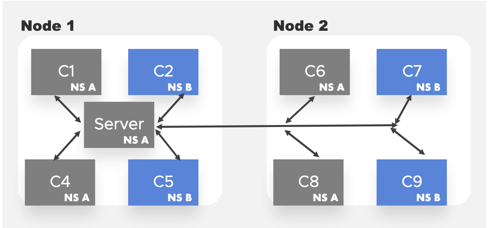

# Rearchitecting network policy tests

## Table of Contents

<!-- toc -->
- [Summary](#summary)
- [Motivation](#motivation)
  - [Goals](#goals)
  - [Non-goals](#non-goals)
- [Proposal](#proposal)
- [Graduation Criteria](#graduation-criteria)
- [Implementation History](#implementation-history)
- [Alternatives](#alternatives)
<!-- /toc -->

## Summary
- Defining a common set of test scenarios for all network policy tests and increasing performance by reusing a set of containers.
- Rearchitecting network policy tests to enhance readibility and reusability.

## Motivation 
 
The current network policy tests have the following issues which, without increasing technical debt, can be addressed architecturally.
 
- **Incompleteness**: There is no common set of positive or negative scenarios to confirm different policies.
- **Understandability**: They are difficult to reason about, due to lack of consistency, completeness, and code duplication.
- **Extensibility**: Extending them is a verbose process, which leads to more sprawl in terms of test implementation.
- **Performance**: They suffer from low performance due to the high number of pods created.  Network policy tests can take 30 minutes or longer.
- **Documentation and Community**: The overall situation for these tests is that they are underdocumented and poorly understood by the community, and its not clear how these tests are vetted when they are modified.
 
**Related issues**:  TODO, find these and fill them out, most importantly the ingress update pod issue which demonstrates that we arent curating these tests as a community.
 
**Consequences of this problem**
 
The consequences of this problem is that
 
- CNI providers cannot easily be compared for functionality.
- CNI providers implementing network policies must carry a lot of downstream test functionality.
- Testing a CNI provider for Kubernetes compatibility requires a lot of interpretation and time investment.
- Extending NetworkPolicy tests is time consuming and error prone, without a structured review process and acceptance standard.
- It is hard to debug tests, due to the performance characteristics - pods are deleted after each test, so we cannot reproduce the state of the cluster easily.
 
**Detailed Examples of the Problem statement**
 
**Incompleteness**
 
For our first example, we will look at the incompleteness of one of the first tests in the test suite for network_policy.go.  In this test, the following assertions are made to verify that inter-namespace traffic can be blocked via NetworkPolicys.
 
The "X" lines denote communication which is blocked, whereas standard arrows denote
traffic that is allowed.
 
```
+-------------------------------------------------------------------+
| +------+    +-------+   Figure 1a: The NetworkPolicy Tests        |
| |      |    |       |   current logical structure only verifies   |
| |  cA  |    |  cB   |   one of many possible network connectivity |
| |      |    |       |   requirements. Pods and servers are both   |
| +--+---+    +--X----+   in the same node and namespace.           |
|    |           X                                                  |
|    |           X                                                  |
+----v-----------X+---+                                             |
||     server         |    Note that the server runs in the         |
||     80, 81         |    "framework" namespace, and so we don't   |
||                    |    draw that namespace specifically here,   |
||                    |    as that namespace is an e2e default.     |
|---------------------+                                             |
+-------------------------------------------------------------------+
```

An important set of scenarios this test do not cover is as follows:
 
- namespaces B and C, in addition to the framework namespace
- each of these namespaces has 2 containers in them
- each of the containers in each of these namespaces attempts connecting to each port on the server
More details are in the Design section.
 
```
+-------------------------------------------------------------------------+
|  +------+              +------+                                         |
|  |      |              |      |                                         |
|  |   cA |              |  cB  |     Figure 1b: The above test           |
|  +--+---+              +----+-+     is only complete if a permutation   |
|     |   +---------------+   |       of other test scenarios which       |
|     |   |    server     |   |       guarantee that (1) There is no      |
|     +--->    80,81      +<--+       namespace that whitelists traffic   |
|         |               |           and that (2) there is no "container"
|         +----X--X-------+           which whitelists traffic.           |
| +------------X--X---------------+                                       |
| |            X  X               |   We limit the amount of namespaces   |
| |   +------+-X  X-+-------+  nsB|   to test to 2 because 2 is the union |
| |   |      | X  X |       |     |   of all namespaces.                  |
| |   |  cA  | X  X |   cB  |     |                                       |
| |   |      | X  X |       |     |   By leveraging the union of all      |
| |   +------+ X  X +-------+     |   namespaces we make *all* network    |
| |            X  X               |   policy tests comparable,            |
| +-------------------------------+   to one another via a simple         |
|  +-----------X--X---------------+   truth table.                        |
|  |           X  X               |                                       |
|  |  +------+-X  X-+-------+  nsC|   This fulfills one of the core       |
|  |  |      |      |       |     |   requirements of this proposal:      |
|  |  |  cA  |      |   cB  |     |   comparing and reasoning about       |
|  |  |      |      |       |     |   network policy test completeness    |
|  |  +------+      +-------+     |   in a deterministic manner which     |
|  |                              |   doesnt require reading the code.    |
|  +------------------------------+                                       |
|                                      Note that the tests above are all  |
|                                      done in the "framework" namespace. |
|                                                  similar to figure 1.   |
+-------------------------------------------------------------------------+
```
 
**Understandability**

In this next case, we'll take another example test, which is meant to confirm that intra-namespace
traffic rules work properly.  This test has a misleading description, and an incomplete test matrix as well.
 
"Understandability" and "Completeness" are not entirely orthogonal - as illustrated here.  The fact that
we do not cover all communication scenarios (which will be provided in the design section), means that we have to carefully read the code fore this test, to assert that it is testing the same scenario that its Ginkgo description connotes.
 
We find that the Ginkgo description for this test isn't entirely correct, because
enforcing traffic *only* from a different namespace also means:
- Blocking traffic from the same namespace
- Confirming traffic from *any* pod in the whitelisted namespace
 
As an example of the pitfall in this test, a network policy provider which, by default
allowed all internamespaced traffic as whitelisted, would pass this test while violating
the semantics of it.
 
```

+----------------------------------------------------------------------------------------------+
|                  a)                        b)                                                |
|           +------------------+       +-------------------+                Figure 2:          |
|           |                  |       | +---+      +---+  |                                   |
|   XXXXXXXXX                  |       | | cA|      | cB|  |                A more advanced    |
|   X       |                  |       | +X--+      +---+  |                example. In these  |
|   X       |                  |       |  X             X  |                cases, we can      |
|   X  ^---->     server       |       |  X   server    X  |                increase test      |
|   X  |    |      80,81       |     XXXXXXXXX 80,81 XXXX  |                coverage again     |
|   X  |    +------------------+     X +-------^-----------+                by testing an      |
|   X  |                       |     X         |                            entire truth       |
|   X  |    +------------------+     X +-------------------+                table (Fig2-b).    |
|   X  |    |                  |     X |       |           |                                   |
|   X  |    |    +--+   +---+  |     X | +-----+----+---+  |                The "creating a    |
|   X  ----------+cA|   |cB |  |     X | |cA|       | cB|  |                network policy     |
|   X       |    +--+   +---+  |     X | +--+       +---+  |                for the server which
|   X       |   nsA            |     X |      nsA          |                allows traffic     |
|   X       +------------------+     X +-------------------+                from ns different  |
|   X                          |     X                                      than namespace-a"  |
|   X       +------------------+     X  +------------------+                                   |
|   X       |                  |     X  |  +--+            |                test is imprecisely|
|   X       |   +--+    +--+   |     XXXXXX|cA|     +---+  |                named, and also    |
|   +XXXXXXXXXXX|cA|    |cB|   |     X  |  +--+     | cB|  |                lacks verification |
|   |       |   +--+    +-++   |     X  |           +---+  |                of local namespace |
|   |       |             |    |     X  |             X    |                holes and port     |
|   |       |     nsB     |    |     X  |    nsB      X    |                holes(Fig2-a).     |
|   |       +------------------+     X  +-------------X----+                                   |
|   |                     |          X                X                                        |
|   |                     |          XXXXXXXXXXXXXXXXXX                                        |
|   +---------------------+                                                                    |
|                                                                                              |
+----------------------------------------------------------------------------------------------+
```
 
**Extensibility**
 
The previous scenarios look at logical issues with the current tests.  These issues can be mitigated by simply having more tests, which are as verbose as the existing tests.  However,
 
- Each test can be between 50 to 100 lines long.
- The network policy's created in each test can be around 30 lines or so.
- There are 23 current tests.
 
Thus, in order to build a new test:
 
- We need to read the other tests, and attempt to capture their logic, for consistency's sake.
- The logic is different in each test, so, what positive and negative controls should be run
is not clear.
- Any given network policy test can take a minute or so to verify, because of namespace
deletion and pod startup times, meaning new tests of a simple network policy add a non-trivial
amount of time to the network policy tests, even though the time it takes to apply a network
policy is instantaneous, and the test itself is completely stateless.
- Comparing network policies between tests requires reading verbose Go structs.
 
As an example of the cost of extensibility, we compare the subtle distinction between the following tests:
 
1) `should enforce policy based on PodSelector or NamespaceSelector`
2) `should enforce policy based on PodSelector and NamespaceSelector`
 
These tests use an almost identical harnesses, with a subtle `},{` clause
differentiating the stacked network policy (an or selector) vs. a combined policy.
 
```
 
                    Ingress: []networkingv1.NetworkPolicyIngressRule{{
                        From: []networkingv1.NetworkPolicyPeer{
                            {
                                // TODO add these composably, so that can be disambugated from combo networkpolicypeer
                                PodSelector: &metav1.LabelSelector{
                                    MatchLabels: map[string]string{
                                        "pod-name": "client-b",
                                    },
                                },
                            },
                            {
                                NamespaceSelector: &metav1.LabelSelector{
                                    MatchLabels: map[string]string{
                                        "ns-name": nsBName,
                                    },
                                },
                            },
                        },
                    }},
```
 
The AND test is obviously more selective, although it is tricky to tell from the struct that
it has been correctly written to be different from the OR test...
 
```
                    Ingress: []networkingv1.NetworkPolicyIngressRule{{
                        From: []networkingv1.NetworkPolicyPeer{
                            {
                                PodSelector: &metav1.LabelSelector{
                                    MatchLabels: map[string]string{
                                        "pod-name": "client-b",
                                    },
                                },
                                // because we lack {,} , these are independent stacked
                                // policies.  this is difficult to verify for correctness
                                // at a glance, due to the verbosity of the struct. 
                                NamespaceSelector: &metav1.LabelSelector{
                                    MatchLabels: map[string]string{
                                        "ns-name": nsBName,
                                    },
                                },
                            },
                        },
```
 
If we were to generate policies from predefined constants, this could be easily addressed, without adding any framework/harness overhead.
 
```
 
                    Ingress: []networkingv1.NetworkPolicyIngressRule{{
                        From: []networkingv1.NetworkPolicyPeer{
                            {
                                PodSelector: clientBPod
                            }, 
                            {
                                NamespaceSelector: nsASelector
                            },
                        },
```
 
```
 
                    Ingress: []networkingv1.NetworkPolicyIngressRule{{
                        From: []networkingv1.NetworkPolicyPeer{
                            {
                                PodSelector: clientBPod,
                                NamespaceSelector: nsASelector
                            },
                        },
```
 
This would also of course make code much more reusable.
 
**Performance**
 
For every current test, a new container is spun up, and a polling process occurs where we wait for the pod to complete succesfully.  Because all clusters start pods at different rates, heuristics have to be relied on for timing a test out.  A large, slow cluster may not be capable of spinning pods of quickly, and thus may timeout one of the 23 tests, leading to a false negative result.
 
In some clusters, for example, namespace deletion is known to be slow - and in these cases the network policy tests may take more then an hour to complete.
 
- If network policys or pod CIDR's are not correct, its likely all tests can fail, and thus the network policy suite may take an hour to finish, based on the estimate of 3 minutes, for each failed test, alongside 23 tests (in general , NetworkPolicy tests on a healthy EC2 cluster, with no traffic and broken network policy's, take between 150 and 200 seconds complete).
 
*Performance's Relationship to Understandability*: Logging verbosity is worse for slow tests.
 
Slow running tests are also hard to understand, because logging and metadata is expanded over a larger period of time, increasing the amount
of information needed to be attended to diagnose an issue. For example, to test this, we have intentionally misconfigured my CIDR information for a calico CNI,
and found that the following verbose logging about is returned when running the `NetworkPolicy` suite:
```
Feb  4 16:01:16.747: INFO: Pod "client-a-swm8q": Phase="Pending", Reason="", readiness=false. Elapsed: 1.87729ms
... 26 more lines ...
Feb  4 16:02:04.808: INFO: Pod "client-a-swm8q": Phase="Failed", Reason="", readiness=false. Elapsed: 48.063517483s
```
Thus, the majority of the logging information from a CNI which may have an issue is actually related to the various polling operations
which occured, rather then to the test itself.  Of course, this makes sense - since we always recreate pods, we have to potentially
wait many seconds for those pods to come up.
 
Thus, by increasing the performance of our tests, we also increase their understandability, because the amount of information needed to be
audited for inspecting a failure may be reduced by a 50% (currently, 50% of the output for failing network policy tests is that of the polling
process for pods spinning up, which is easily avoided by a fixed server and client pod).
 
**Documentation**
 
Documenting network states is very hard, in any scenario.  Since the NetworkPolicy ginkgo tests are curently not documented outside of the code, no specific evidence is required here.  This proposal aims not to Document these tests, but rather , to make the code more readable, and thus self-documenting.  However, formal documentation of how network policies, generally, are evaluated using a truth table approach, is a part of this proposal.  This generic documentation will be insightful and concise for those needing to test their NetworkPolicy implementations, and likely to not go obsolete, due to the generic nature of the truth-table/matrix approach (compared to the highly specific nature of existing tests).
 
## Proposal
 
This KEP proposes the following solutions to this problem:
 
- *Increase performance* of tests by using persistent Deployments.
- *Increase understandability* by defining network scenario objects which can easily by modified and reused between tests, and outputting the entire contents of the truth table for each test, in some manner.
- *Increase completeness* by using a logical truth table which tests connectivity/disconnectivity for each scenario above.
- *Increase extensibility* by leveraging the scenario objects and the completeness checking functionality above.
- *Increase debuggability* by leveraging the performance changes above.
- *Audit all existing tests* For logical redundancy and consistency
 
## Design Details
 
There are many solutions, and this proposal outlines the most obvious approach which is relatively simple to implement, and minimally abstract, so as to not overcomplicate the testing framework or add technical debt.
  
**Part 1:**
 
1. Define a common set of namespaces, and pods, used to make a truth table that applies to all tests. 
 
 In this figure, network policies will be tested on inter/intra-namespace support on the same node and inter-intra namespace support on different nodes.
Another important test case if testing host-network only containers. C4, C5, C8, and C9 are host-network only containers.
 
2. Define a structure for expressing the truth table of results.   Since clasically a truth table can be expressed as a 2D matrix, where
rows and columns are the lexically sorted list of all pod namespace pairs defined above, formatted as `namespace-pod`.  For example, a truth table defining a NetworkPolicy where only pods in the same namespace of the server can communicate to it, would look like this.
 
|    | S  | C1 | C2 | C4 | C5 |  C6| C7 | C8 | C9 |
|----|----|----|----|----|----|----|----|----|----|
| S  | 1  | 1  | 0  | 1  | 0  |  1 | 0  | 1  | 0  |
| C1 | 1  | 0  | 0  | 0  | 0  |  0 | 0  | 0  | 0  |
| C2 | 0  | 0  | 0  | 0  | 0  |  0 | 0  | 0  | 0  |
| C4 | 1  | 0  | 0  | 0  | 0  |  0 | 0  | 0  | 0  |
| C5 | 0  | 0  | 0  | 0  | 0  |  0 | 0  | 0  | 0  |
| C6 | 1  | 0  | 0  | 0  | 0  |  0 | 0  | 0  | 0  |
| C7 | 0  | 0  | 0  | 0  | 0  |  0 | 0  | 0  | 0  |
| C8 | 1  | 0  | 0  | 0  | 0  |  0 | 0  | 0  | 0  |
| C9 | 0  | 0  | 0  | 0  | 0  |  0 | 0  | 0  | 0  |

Most of the Matrices for this table will be permuting the first row and column, since the server pod currently always resides in the framework namespace.  However, tests might confirm two way connectivity
and other types of connectivity in the future, and such an expansion would work very cleanly with a matrix.
 
Part of this invovles a pretty-print functionality for these tables, which can be output at the end of each Network policy test.  In failed
test scenarios, these tables can be compared, and one may easily parse out a logical inference such as "Everything outside the frameowrk
namespace has connectivity, even when the truth table explicitly forbids it", which might, for example, point to a bug in a CNI provider
related to flagrantly allowing internamespace traffic.  Since it is obvious how such a matrix might be defined in Go, we dont provide a
code snippet or API example.
 
 **Part 2:**
 
*Only define whitelisted communication as part of the verification of connectivity*
 
Since verification is quite extensive for these tests, the `Ginkgo.By` statements will be done iteratively,
rather then using bespoke sentences for each case.  This can be done by mapping a set of predefined network policies to a change set, which defines exactly which namespace/pod pairs are allowed to talk to one another.  This can be expressed in go code as follows:
 
```
policyForTest1 := networkinvv1.NetworkPolicySpec{...}
policyForTest1Description := "Confirm that local namespace traffic is whitelisted"
policiesMap["policyForTest1"] := map[string]string{"FaFa":1, "FbFa":1}
```
 
Once this policiesMap is defined, Ginkgo.By statements may
 
*Reusable static snippets for namespaces and pods*
 
The definition of the 'policyForTest1' will be made concsie by the following mechanism.
 
Make resuable variables for podSelectors, namespace selectors, labels, and other verbose aspects of golang defined NetworkPolicyStructs
 
Currently almost every test had a clause such as:
```
            nsA := f.Namespace
            nsBName := f.BaseName + "-b"
            nsB, err := f.CreateNamespace(nsBName, map[string]string{
                "ns-name": nsBName,
            })
```
 
And a verbose `policy := &networkingv1.NetworkPolicy{ ... }` declaration, which is 20 to 50 lines long (see problem statement for details).
 
To reduce the boilerplate in these segments (and most importantly, to make it very easy to differentiate the policys), we will declare the following
reusable structures:
 
1. PodSelector for the server
 
```
        PodSelector: metav1.LabelSelector{
                MatchLabels: map[string]string{
                    "pod-name": podServerLabelSelector,
                },
        },
```
Will get replaced with `PodSelector: metav1.LabelSelector{server}`.
 
2. Client side pod selector labels will be made for all pods (a,b,c) defined in Part 1.
 
```
        PodSelector: &metav1.LabelSelector{
                MatchLabels: map[string]string{
                    "pod-name": "client-a",
                },
        }
```
3. Namespace selectors will be made analagous to (2).
 
This will result in a very concise namespace definition:
 
```
    Ingress: []networkingv1.NetworkPolicyIngressRule{{
                        From: []networkingv1.NetworkPolicyPeer{{
                            NamespaceSelector: &metav1.LabelSelector{
                                MatchLabels: map[string]string{
                                    "ns-name": nsBName,
                                },
                            },
                            PodSelector: &metav1.LabelSelector{
                                MatchLabels: map[string]string{
                                    "pod-name": "client-a",
                                },
                            },
                        }},
                    }},
```
Would, for example, be replaced with:
```
          Ingress: []networkingv1.NetworkPolicyIngressRule{{
                        From: []networkingv1.NetworkPolicyPeer{{
                            NamespaceSelector: nsB,
                            PodSelector: clientA,
                        }},
            }},
```
 
Of course, we may be able to make these even smaller, but for this proposal are erring on changes which are
not too abstract relative to the essentials of what needs to be conveyed.  It is obvious that using functions, we could make the reduction of boilerplate even more concise, and we are of course open to
exploring this further as we move through the implementation stages.
 
 
**Part 3:**
 
Rewrite each individual test, reviewing semantics, to be precisely worded (and possibly verbose), and to simply define a specific policy and
set of 'whitelisted' communication associated with this policy.  The whitelisting would be defined as a map of namespace->pods, since all other
information in the truth table is false.
 
*Note on Acceptance*
 
Of course, each old tests will be converted to a truth table, first, as part of this work, so that the parity between old and new tests is
clear and obvious (alternatively, these can be a next generation of policy tests which live in parallel to existing network policy tests for a release cycle, while they are vetted).
 
*Defining community standards and establishing ownership*
 
As of now, network policy tests are not run regularly against any CNI.  Although we should not endorse one CNI over another, we should regularly validate
that the NetworkPolicy tests *can* pass on *some* provider.  As part of this proposal, we propose commiting an annotation to the existing network_policy.go code which states, in clear and simple terms, what environment the network_policy.go test suite was run in, the last time which it was commited and passed.  Its also acceptable to commit this as a Markdown file in the documentation.
 
There may be other, better ways of doing this.  Running an upstream validation job of these tests as a weekly PROW job, for example, would be a good way to make sure that these tests don't regress in the future.  this comes at the cost of coupling a job to an external CNI provider, so its not being explicitly suggested.
 
**Alternative solutions**
 
- Keeping the tests as they are and fixing them one by one
 
We could simply audit existing tests for completeness, and one-by-one, add new test coverage where it is lacking.  This may be feasible for the 23 tests we currently have, but it would be likely to bit-rot over time, and not solve the extensibility or debuggability problems.
 
- Building a framework for NetworkPolicy evaluation
 
In this proposal, we've avoided suggesting a complex framework that could generate large numbers of services and pods, and large permuatations of scenarios.
However, it should be noted that such a framework might be useful in testing performance at larger scales, and comparing CNI providers with one another. Such a framework could easily be adopted to cover the minimal needs of the NetworkPplicy implemetnation in core Kubernetes, so it might be an interesting initiative to work on.  Such an initiative might fall on the shoulders of another Sig, related to performance or scale.  Since NetworkPolicy's have many easy to address
problems which are important as they stand, we avoid going down this rat-hole, for now.
 
That said, the work proposed here might be a first step towared a more generic CNI testing model.
